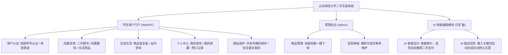

# 山东财经大学 · 校园二手物品互助服务系统 (SDUFE Campus Exchange)
> **全国大学生数字媒体设计大赛参赛作品 · 绿色低碳校园闲置流转平台**

[](https://escoffierzhou.github.io/Secondhand-goods-on-campus/#/)
[](https://vuejs.org/)
[](https://element-plus.org/)
[](https://pinia.vuejs.org/)
[](./项目说明书.md)

---

## 📑 核心文档快速跳转

- 📖 **[完整项目说明书与答辩评审手册](./项目说明书.md)**：包含详细的痛点调研、架构设计、10大业务页面清单、手机隐私脱敏安全规范与演示测试用例。

🌐 **项目在线演示与评审地址 (GitHub Pages)**：  
👉 [https://escoffierzhou.github.io/Secondhand-goods-on-campus/#/](https://escoffierzhou.github.io/Secondhand-goods-on-campus/#/)

---

## 一、项目背景与参赛定位

在**山东财经大学（圣井校区、燕山校区、舜耕校区）**的跨校区学习生活中，每逢毕业季与学期更替，大批经管教材、考研数三真题、宿舍生活物品（代步车、台灯、置物架）常面临闲置浪费或被低价卖废纸的困扰；与此同时，低年级同学对平价二手专业书与生活物资有着极高需求。

本项目专为**山东财经大学**全校师生量身打造，建设**安全、可信、高效、低碳的校园二手物品互助流转平台**：
- **目标用户**：山东财经大学圣井校区、燕山校区、舜耕校区在校本科生、研究生及教职工。
- **业务核心**：经管与计科专业教材循环、数码小家电流转、校园兼职求职互助、求购心愿单与低碳碳普惠展馆。
- **设计初衷**：以数字化媒体交互与前端工程为基石，兼顾学生隐私安全与绿色循环理念。

---

## 二、竞赛赛道功能矩阵

根据大赛评审标准与业务闭环要求，本系统分为三大核心端态与拓展模块：



### 1. 用户端核心功能
- **校园身份认证**：支持校园学号实名认证与普通访客体验，严格规范交易主体。
- **二手物品流转**：
  - **二手图书专区**：涵盖《微观经济学》《计量经济学》《初级会计实务》《数三真题》等专业课及考研教材；
  - **闲置杂货专区**：数码配件、寝室家电、圣井代步自行车等分类过滤；
  - **校园兼职专区**：校内图书馆勤工助学、历下/章丘家教招募。
- **物品留言沟通板块**：每个物品详情页下方配备开放式留言沟通区，买卖双方可就成色细节、自提地点进行站内公开答复。
- **学生个人中心**：
  - 我的发布：实时管理上架物品，支持随时下架与修改；
  - 我的收藏：一键收藏心仪物品，便于多方比价与追踪；
  - 预约面交订单：线上约定校区与时间，线下白天当面验货。
- **数据与隐私安全设计（重点合规）**：
  - 符合教育部与数字媒体大赛个人信息保护规范，**手机号等个人联系方式不直接裸露展示**（采用 `138****8888` 掩码脱敏），引导通过站内留言或预约单沟通。

### 2. 运营与管理后台 (Admin)
- 管理员可实时监控平台物品动态，对不合规、虚假信息或已违规物品执行一键下架与封存。

### 3. AI 创新拓展亮点 (AI 智能助手)
- **AI 智能二手估价助手**：根据原价、成色评级（全新/微瑕/较多磨损）及折旧率算法模型，为学生卖家提供科学合理的转让建议价格；
- **AI 文案生成智能体**：卖家仅需输入简要关键词（如“毕业带不走、只用过两次”），AI 即可一键生成趣味且真实的寝室大甩卖商品描述。

---

## 三、系统技术架构

| 层次 | 选用技术 / 方案 | 设计说明 |
| :--- | :--- | :--- |
| **表现层** | Vue 3 + Composition API (`<script setup>`) | 组件高复用、性能轻量、现代响应式驱动 |
| **UI 设计体系** | Element Plus 2.x + `@element-plus/icons-vue` | 针对桌面端大屏专门排版定制，支持栅格、表单、弹窗 |
| **状态层** | Pinia | 轻量级状态中心，统一协调用户会话、收藏夹与购物车 |
| **路由层** | Vue Router 4 (Hash 模式) | 完美消除静态托管（GitHub Pages）子路径刷新 404 隐患 |
| **数据与存储** | 响应式 LocalStorage 仓储引擎 | 纯静态即可流畅闭环增删改查，开箱即评测，刷新不丢失 |
| **CI/CD** | GitHub Actions 自动化工作流 | 提交代码自动触发编译并发布至 GitHub Pages |

---

## 四、本地运行指南

### 环境要求
- Node.js >= 18.0.0
- npm >= 9.0.0

### 快速启动
#### 方式 1：双击批处理（Windows 用户推荐）
直接双击根目录下的 [`start-pc-web.bat`](./start-pc-web.bat) 即可全自动拉取依赖并启动。

#### 方式 2：命令行启动
```bash
# 进入前端工程目录
cd pc-web

# 启动开发服务器
npm run dev

# 浏览器访问：http://localhost:3000/#/
```

### 生产打包构建
```bash
npm run build
```
编译产物位于 `pc-web/dist/` 目录中。

---

## 五、大赛演示账号与测试数据

系统内置预置演示数据集与典型学生账号，方便评委与测试人员即开即测：
- **测试认证学号**：`2021081023`
- **认证密码**：`666666`
- **身份示例**：周同学（圣井校区 · 计算机科学与技术学院）
- **数据重置**：顶部状态栏内置“重置演示数据”按钮，可随时恢复到初始洁净状态。

---

## 六、参赛团队分工规划

- **软件开发 / 架构设计**：系统架构搭建、前端界面开发、数据流转闭环、后台管理。
- **AI 赋能 / 算法辅助**：二手估价折旧模型设计、文案生成 Prompt 工程、演示视频录制与剪辑。
- **媒体与视觉设计**：UI 规范定义、主视觉配色、宣传海报与产品交互设计。
