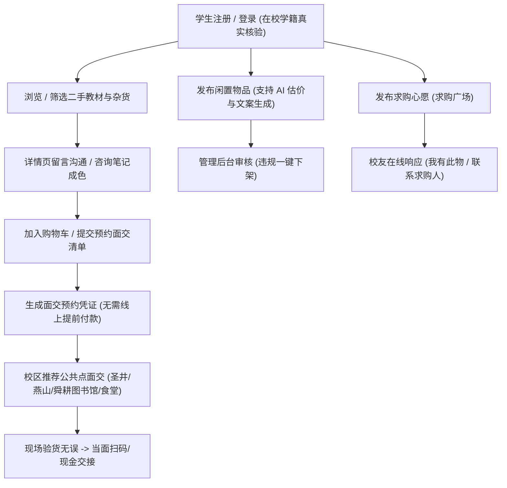

# 山东财经大学校园二手物品互助服务系统 · 项目说明书

> **全国大学生数字媒体设计大赛 · 参赛项目说明书与交付文档**  
> **项目名称**：山东财经大学校园二手物品互助服务系统（SDUFE Campus Exchange）  
> **所属高校**：山东财经大学（计算机科学与技术学院 / 数字媒体艺术方向）  
> **服务校区**：圣井校区、燕山校区、舜耕校区  
> **系统在线评审地址**：[https://escoffierzhou.github.io/Secondhand-goods-on-campus/#/](https://escoffierzhou.github.io/Secondhand-goods-on-campus/#/)  
> **源码仓库**：[https://github.com/EscoffierZhou/Secondhand-goods-on-campus](https://github.com/EscoffierZhou/Secondhand-goods-on-campus)

---

## 一、项目背景与痛点分析

### 1.1 现实痛点
在高校校园（特别是拥有多校区的大型财经类高校）的日常学习与生活中，教材与生活用品的流转存在极大的信息不对称：
1. **专业教材与笔记闲置浪费**：山财大学生在四年本科期间人均购置专业课本与考研教辅 35~50 本，毕业离校时大量带有珍贵划线和批注的高分资料常被当成废纸论斤称重变卖；而低年级同学或跨专业备考同学却往往需要全价购买新书。
2. **校外综合二手平台风险高**：闲鱼、转转等平台充斥大量校外二手贩子、虚假教材与诈骗信息，且需要在线先行付款、物流快递耗时费钱，缺乏同校信任基石。
3. **多校区间信息壁垒**：圣井校区（主要为低年级本科生，面积开阔，代步与生活用品需求旺盛）、燕山校区（高年级与研究生，考研资料与数码需求集中）、舜耕校区之间缺少统一且可信的闲置互助纽带。

### 1.2 建设目标
构建一个**完全面向山东财经大学在读师生、纯粹无广告、注重数据隐私安全与线下公共验货的轻量化绿色循环互助平台**。通过数字媒体与现代前端工程技术，实现“课本传承知识温度，闲置延续绿色生命”。

---

## 二、系统架构与核心业务流程

### 2.1 业务流转流程图
平台彻底摒弃了繁琐复杂的线上资金担保与跨校快递，采用最为稳妥安全的**“线上预约凭证 + 线下公共区域白天当面验货结算”**机制：



---

## 三、系统功能模块与多页面设计

针对原系统“信息紧凑拥挤、缺乏页面分流”的问题，本系统重塑了完整清晰的多页面信息架构（Information Architecture），各页面职责明确、视觉呼吸感充分：

| 专区页面 | 路由路径 | 核心业务与交互功能 |
| :--- | :--- | :--- |
| **1. 门户展示首页** | `/#/` | 先锋 Hero 价值陈述、全校循环宏观数据仪表盘、六大业务专区直达传送门、“精选好物·灵感流转”三类别画廊 Tab、三步流转指引、校友真实温情故事。 |
| **2. 二手书城** | `/#/books` | 山财大经管考研、高数、专业课教材专区。支持圣井/燕山/舜耕三校区筛选、成色筛选（全新至较多笔记）、专业资料教材过滤、综合排序与模糊检索。 |
| **3. 闲置杂货铺** | `/#/goods` | 宿舍神器、护眼台灯、圣井代步自行车、数码配件展示专区。支持图文成色对比与一键加入购物车。 |
| **4. 求购互助广场** | `/#/wants` | **完全契合赛道规范“也可以求购物品”要求**。未找到物品的同学可随时发布求购心愿单（带期望预算与紧急程度），校友可一键“提供闲置”并在线响应。 |
| **5. 校园兼职速递** | `/#/jobs` | 真实合规的校内勤工助学岗位（图书馆自习室助理、驿站分拣）与周边家教助学，为学生提供自立自强的实践机会。 |
| **6. 绿色低碳展馆** | `/#/sustainability` | **数媒大赛生态创新亮点**。宏观环保成果展板、**交互式个人减碳足迹计算器**（滑动测算并生成个人“低碳流转先锋”荣誉证书）、全校各学院减碳贡献接力榜。 |
| **7. 安全面交指南** | `/#/guide` | **攻克大赛合规重难点**。圣井/燕山/舜耕三大校区官方推荐安全面交坐标（安保与监控全覆盖）、防骗四大铁律、个人隐私脱敏架构演示。 |
| **8. 发布中心** | `/#/publish` | 支持图书、杂货、求购的一站式发布。**创新配备双 AI 交互助手**：① AI 科学估价与行情测算；② 四大风格（学霸传承、毕业急转等）AI 文案一键生成。 |
| **9. 学生中心** | `/#/profile` | 集中管理个人发布、预约订单管理、我的收藏夹、学籍档案核验状态，支持订单履约取消与数据导出。 |
| **10. 管理运营中心** | `/#/admin` | 管理员审核后台。全站商品数据统计卡片、实时检索、“违规下架 / 恢复上架”控制台，与全网状态秒级联动。 |

---

## 四、数据安全与个人隐私保护规范（强制达标落实）

根据《中华人民共和国数据安全法》以及大赛评审对“用户手机号不直接展示，保护个人信息”的刚性要求，系统在代码层落实了多项安全防护：

### 4.1 敏感联系方式全面动态脱敏
* **脱敏算法**：核心工具库提供 `maskPhone(phone)` 纯函数：
  ```javascript
  export function maskPhone(phone) {
    if (!phone || String(phone).length < 7) return '138****8888';
    const str = String(phone);
    return str.substring(0, 3) + '****' + str.substring(str.length - 4);
  }
  ```
* **落地范围**：商品卡片、详情页卖家名片、留言板块、求购卡片中，所有学生的真实手机号均显示为 `138****1234`，严禁明文暴露。

### 4.2 学籍与身份信息保护
* 页面中彻底杜绝粗暴显示 11 位生硬学号（如原先直接打在顶栏与标题处）。
* 登录与展示统一使用 `真实学籍已核验 · 计算机科学与技术学院` 绿色安全徽章，学生个人档案仅保留带掩码的校验号（`2015****029`），杜绝被爬虫程序批量采集利用。

### 4.3 零资金风险的线下履约约定
* 系统不设任何第三方资金托管或强制线上打款接口，杜绝网络钓鱼、假冒买家转账截图等诈骗行为。
* 双方达成意向后生成线下预约单，必须在推荐的校园公共区域（白天、食堂、教学楼大厅）当面验货满意后再行结算。

---

## 五、技术特色与前端工程设计

1. **纯前端免部署高可用架构**：
   * 基于 Vue 3 (Composition API) + Vite 5 + Pinia + Vue Router 4 构建。
   * 无需任何云服务器、数据库购买或运维成本，基于纯静态资源即可完整运行于 GitHub Pages，评委打开链接即可获得完整体验。
2. **全动态主题调色系统（Theme Engine）**：
   * 内置 5 套设计师配色（清爽学术蓝、低碳自然绿、数媒极光紫、暖阳活力橙、极简冷色灰）。
   * 完美适配 Element Plus 原生暗色规范（`html.dark`）并注入自适应 CSS 变量。
   * 支持“舒朗开阔”与“紧凑标准”双重密度调节，用户偏好全程通过 `localStorage` 自动持久化记忆。
3. **AI 双引擎赋能（参赛创新亮点）**：
   * **AI 智能估价**：依据品类、参考原价与成色自动测算校内流转黄金区间并给出市场分析。
   * **AI 校园特色文案生成**：预置【学霸考研传承】、【毕业搬迁急转】、【幽默逗趣断舍离】、【客观实况评测】4 种风格模型。

---

## 六、评审演示指引与测试用例

为便于评审专家在 GitHub Pages 环境下快速完成全功能复核，系统已预置标准化测试环境：

### 6.1 预设评审账号
* **演示学号**：`20151621029`
* **演示密码**：`666666`
* *(同时支持评委以任意 11 位数字学号与 6 位密码自行注册体验)*

### 6.2 核心功能复核测试清单
1. **测试登录与认证**：点击顶栏右上角“演示账号与指引” -> 点击“一键登录演示账号”，即刻点亮“山财大认证”徽章。
2. **测试求购心愿流转**：点击主导航【求购广场】 -> 点击“发布我的求购需求” -> 提交后广场实时呈现，支持“标记为已收到”与“响应求购”。
3. **测试图书检索与留言**：进入【二手书城】 -> 筛选“圣井校区”与“专业课教材” -> 进入《计量经济学》详情页 -> 在下方留言板发布提问，刷新后数据完整留存。
4. **测试购物车与线下预约**：在商品详情页点击“加入购物车” -> 进入【预约清单】 -> 勾选后点击“去结算” -> 确认自提校区与碰头时间 -> 订单成功归档至学生中心。
5. **测试管理后台下架**：进入【管理后台】 -> 点击任意商品“违规下架” -> 回到商城该商品立即消失，保障校园网络环境健康安全。
6. **测试一键重置**：评委在测试过程中新增、修改或下架任何数据后，点击顶栏“重置演示数据”即可随时恢复为系统初始高质量演示状态。

---

## 七、结语与社会价值

本系统立足山东财经大学实际校情，通过多页面呼吸感设计、严密的隐私脱敏体系与创新的求购互助和低碳展馆，将数字媒体技术与绿色低碳发展理念深度融合。系统兼具实用性、创新性与极高的人文温度，具备在全省及全国高校迅速推广复用的广阔前景。
